<div align="center">

# OvenClear 🥖✅

**Cottage-food compliance verdicts + auto-reissued labels, kept true as the law changes.**


</div>

---

**The problem** — every US state writes a different cottage-food law (eligible foods, venues, licenses, and the *exact sentence* that must appear on the label), and a home baker either guesses, gives up, or pays a $250 consult that costs more than her first month's profit — and when the law *changes*, nobody tells her the label she's printing is now non-compliant.
**The solution** — a $19 statute-cited "can I sell this?" verdict + a print-ready compliant label, and a $5/mo Law-Watch that **re-issues the label automatically** when the law moves — every decision on a signed, tamper-evident ledger.
**What's built here** — two layers. The deterministic, **fully-offline core**: the rulekit verdict engine (GA/TX deep + CA/FL stubs), a hash-pinned snapshot store, the label composer + byte-verbatim QA gate, the law-watch `diff → materiality → impact → re-issue` loop, a signed hash-chained Ed25519 ledger, and the policy envelope. And the **storefront that sells it** ([`server/`](./server/)): landing page, free verdict, Stripe Checkout, webhook fulfillment, label delivery, and a public per-label provenance page — running on that same core, with no second copy of the decision logic. **149 tests, all green; the core needs no network and no API key.**

> All rule text is **FIXTURE / synthetic** — statute-*shaped* data modeled on real cottage-food programs, never verbatim law. Every citation quote is a verbatim substring of its pinned snapshot, enforced at rulepack registration. What is real versus deferred is stated honestly, module by module, below; reproduce every claim with [`DEMO.md`](./DEMO.md).

---

## 🎬 See it in action — one command

```bash
npm install
npm run self-test
```

A Georgia baker → *"can I sell my sourdough at the farmers market?"* → **eligible**, cited, with a
QA-passing label. Then a replayed Texas rule change fans out to **9 auto-re-issued labels + 5
notices**, every step on a signed, tamper-evident ledger. All offline, all FIXTURE data. It ends with:

```
Ledger: 78 rows, chain OK, 78 signatures, lastHash 620879cff8a562bd…, merkleRoot fa7758f0f920…
SELF-TEST: PASS (12/12 checks)
```

---

## 📸 See it in action

**17 live-execution screenshots** live in [`docs/evidence/`](./docs/evidence/), regenerated by `npm run evidence`
(Playwright, @2x). Every image is a real artifact of a real offline run — the dashboard renders the
committed `verify/data/`, and each terminal frame wraps the **actual captured stdout** of the script
named in its title bar. Nothing is mocked or hand-drawn.

### The judge-visible `/verify` dashboard — `verify/index.html`, opens from `file://` (no server, no fetch)

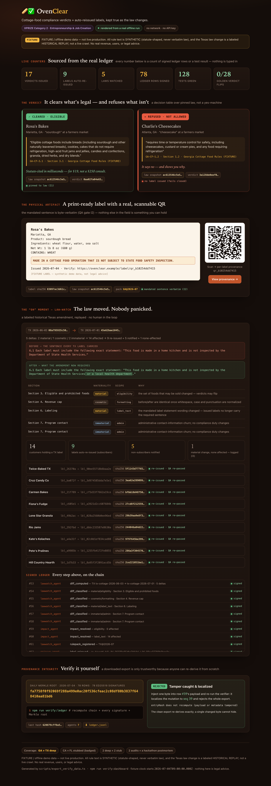

**The magic moment — it clears what's legal *and* refuses what isn't (not a yes-machine):**

<table><tr>
<td width="50%">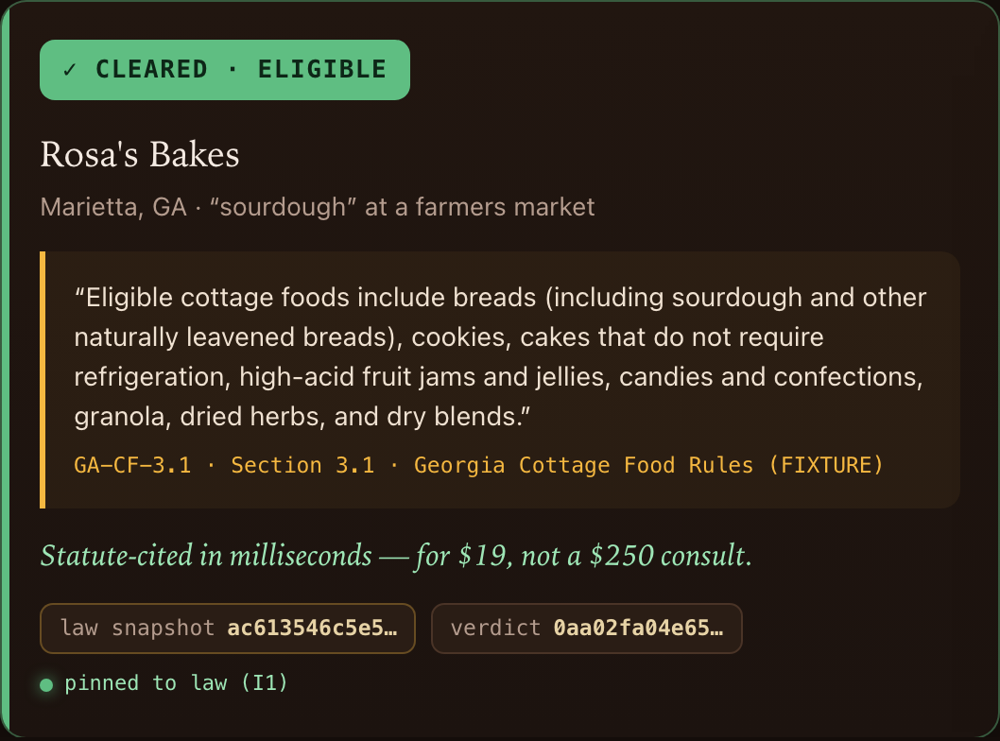<br><sub>GA sourdough → <b>ELIGIBLE</b>, the statute quoted, snapshot-hash pinned (I1).</sub></td>
<td width="50%">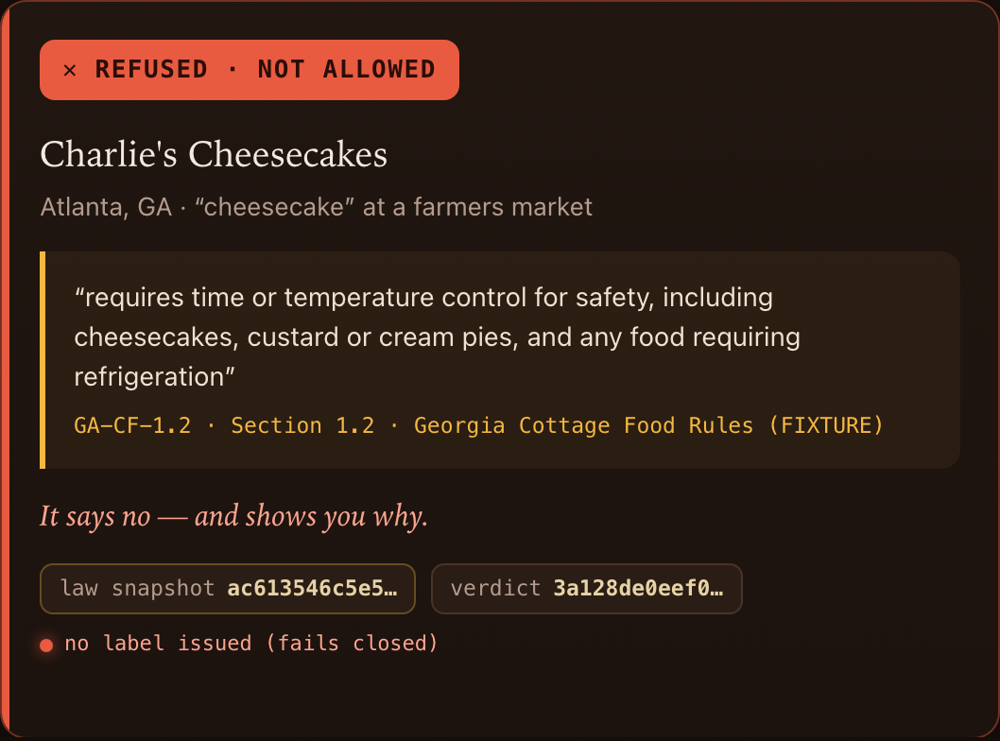<br><sub>Cheesecake → <b>NOT ALLOWED</b> — it quotes the refrigeration rule back at you.</sub></td>
</tr></table>

**The physical artifact — a print-ready label with a real, scannable QR → a per-label provenance page:**

<table><tr>
<td width="52%">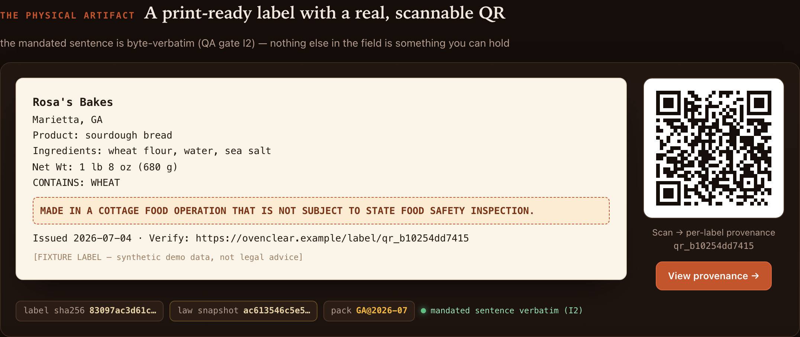<br><sub>The GA-mandated sentence, byte-verbatim (QA gate I2).</sub></td>
<td width="48%">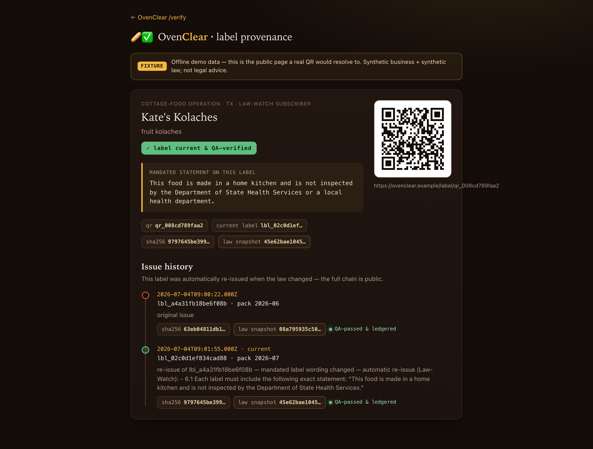<br><sub>The QR resolves here: snapshot hash + full issue history.</sub></td>
</tr></table>

**The moat, made visible — one replayed Texas law change → 9 labels re-issue themselves, on a signed ledger:**

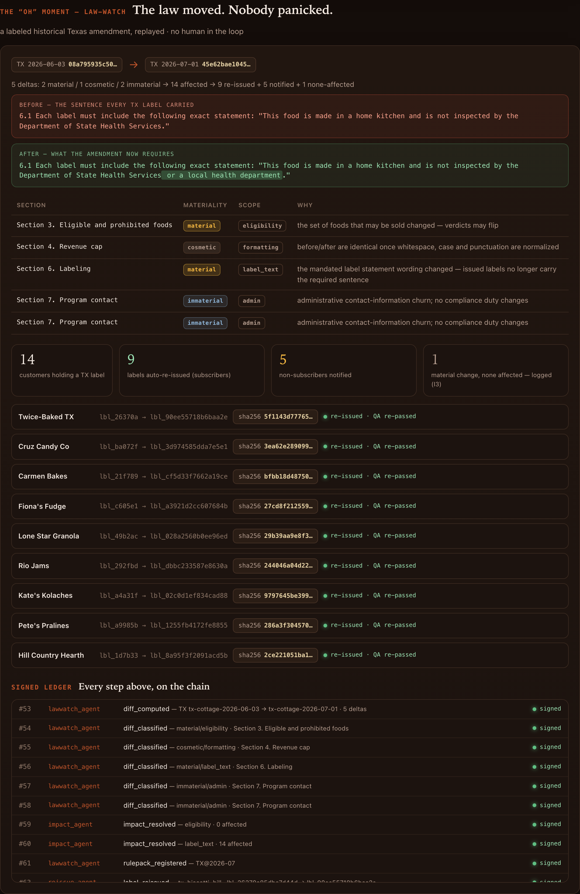

**Verify it yourself — the daily Merkle root, plus a tamper caught and localized to seq 39:**

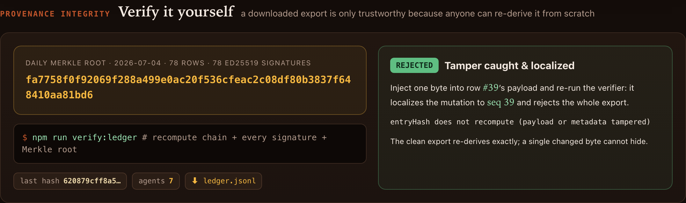

### Terminal evidence — the real proofs + the `rulekit` CLI, captured live

<table><tr>
<td width="50%">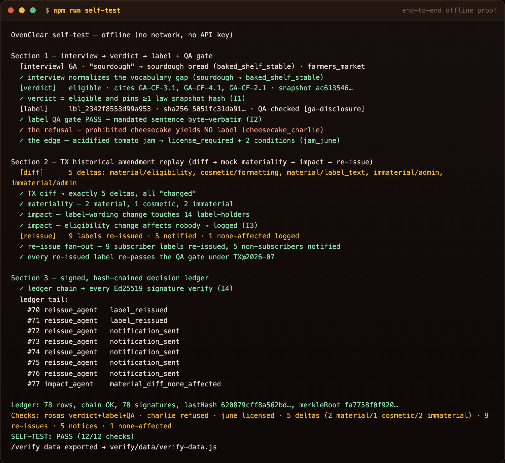<br><sub><code>npm run self-test</code> → PASS (12/12)</sub></td>
<td width="50%">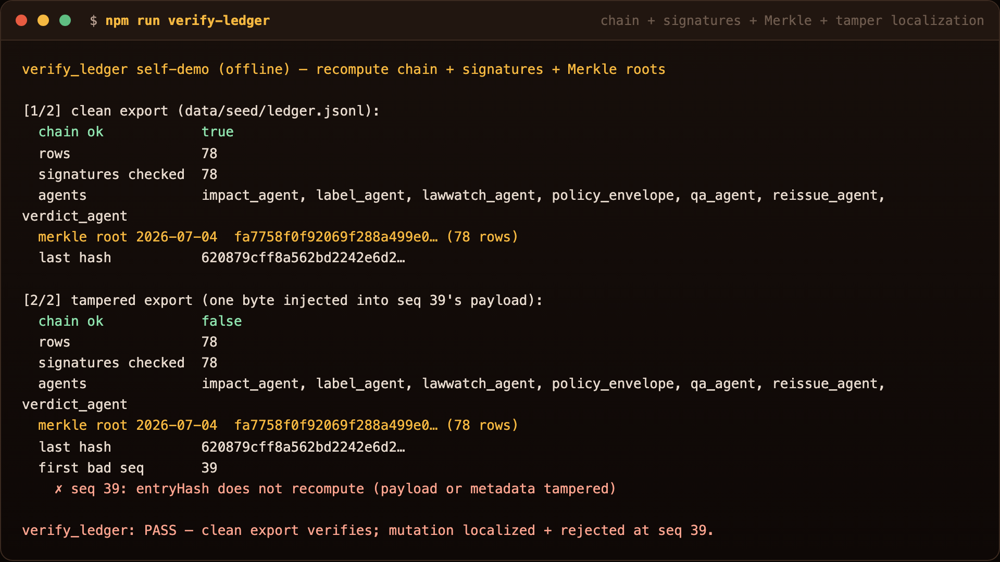<br><sub><code>npm run verify-ledger</code> → tamper rejected @ seq 39</sub></td>
</tr><tr>
<td width="50%">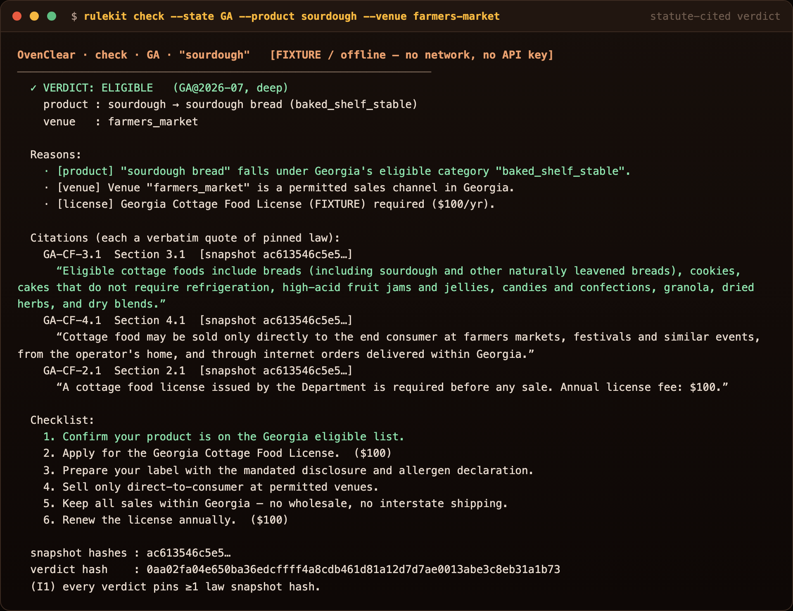<br><sub><code>rulekit check</code> → statute-cited verdict</sub></td>
<td width="50%">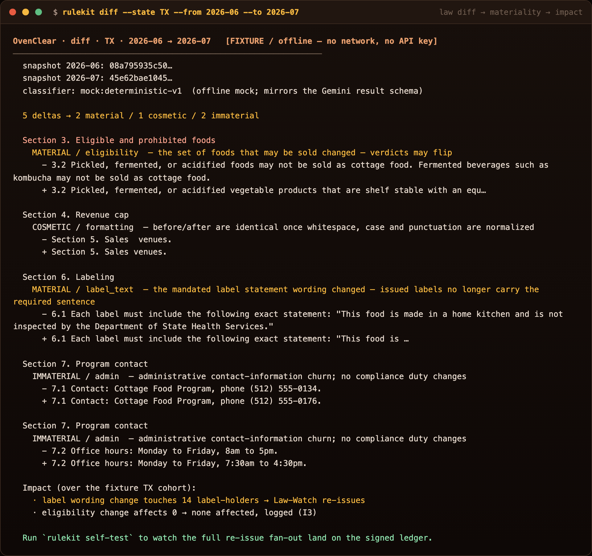<br><sub><code>rulekit diff</code> → materiality classification</sub></td>
</tr></table>

---

## 🧑‍⚖️ For Judges — 60-second quickstart

Everything runs offline, deterministically, with **no API key and no network**:

```bash
npm install
npm run ci                # typecheck → 128 tests → seed:check → self-test → verify-ledger → bench
npm run verify:dashboard  # export the real pipeline data, then open verify/index.html from file://
npm run evidence          # regenerate the 17 live-execution screenshots in docs/evidence/
```

Or run the proofs + the surfaces individually:

| Command | What you witness |
|---|---|
| `npm run self-test`     | interview → verdict → label + QA, the cheesecake **refusal**, then the TX law-change → **9 labels auto-re-issued**; prints the signed-ledger tail → `SELF-TEST: PASS (12/12 checks)`, and exports the `/verify` data |
| `npm run verify-ledger` | recompute the chain + every Ed25519 signature + Merkle roots; a clean export re-derives, then one injected byte is **caught + localized** → `rejected at seq 39` |
| `npm run seed:check`    | build the fixture world twice → **byte-identical** manifest hash; round-trip snapshots + ledger through JSONL → `seed --check: OK` |
| `npm run bench`         | verdict p50 ≈ 24µs / p95 ≈ 36µs over the golden set + **zero verdict flips** → `golden verdict flips: 0 / 28` |
| **`open verify/index.html`** | the self-contained **`/verify` dashboard** — verdict + refusal cards, the label + QR, the TX diff→re-issue ledger, the Merkle badge, live counters. Renders committed real data from `file://` (no server, no `fetch`). |
| **`npx tsx src/cli.ts --help`** | the unified **`rulekit` CLI**: `check` · `label` · `diff` · `self-test` · `verify` · `bench`. |

### The `rulekit` CLI — the moat in a terminal

```bash
npx tsx src/cli.ts check --state GA --product sourdough  --venue farmers-market   # statute-cited verdict
npx tsx src/cli.ts check --state GA --product cheesecake --venue farmers-market   # the refusal
npx tsx src/cli.ts label --state GA --business "Rosa's Bakes"                      # compose + byte-verbatim QA
npx tsx src/cli.ts diff  --state TX --from 2026-06 --to 2026-07                    # law diff → materiality → impact
npx tsx src/cli.ts verify verify/data/ledger.jsonl                                 # re-derive the signed ledger
```

Each subcommand is a thin wrapper over the exact core the tests exercise — no new decision logic.

---

## 🛒 The storefront — the same core, taking money

[`server/`](./server/) is the deployed business: a landing page, the free verdict, Stripe Checkout,
webhook fulfillment, label delivery, and a public per-label provenance page. It calls
`engine.check()` and `issueLabel()` directly — there is **no second copy of the decision logic**,
which is why the offline golden suite is also a regression suite for the live product.

```bash
npm run serve      # http://localhost:8080 — works with no Stripe key and no Gemini key
```

Three design decisions worth reading the code for:

- **A prohibited verdict never reaches checkout.** The verdict is computed *before* payment and
  re-computed server-side at checkout, so a hidden-field edit cannot talk it into selling a label
  for a food the state disallows. If a prohibited order is somehow paid, fulfillment refuses the
  label and flags a refund rather than keeping the money —
  [`server/fulfill.ts`](./server/fulfill.ts).
- **Gemini may widen recall, never change a decision.** The deterministic catalog runs first; only
  on a miss does Gemini get a turn, constrained to an enum of the catalog itself, and its answer is
  re-checked by the same normalizer before any rule runs. The model can rescue *"my tangy no-knead
  boule"* into `sourdough bread`. It cannot invent a product, move it between categories, or turn a
  refusal into a sale — [`server/product-resolver.ts`](./server/product-resolver.ts).
- **The QA gate still fails closed, after payment.** A label that cannot prove its mandated
  sentences are byte-verbatim does not ship, paid or not.

The signed ledger is public at `/ledger.jsonl` and verifiable with `npm run verify-ledger`.
Deployment is [`DEPLOY.md`](./DEPLOY.md) — Cloud Run, GCS-mounted ledger, Secret Manager.

> **Live instance:** `[LIVE-FILL: Cloud Run URL once deployed]`

---

## Test count

**149 tests across 10 files**, all green. Confirm with `npm test`:

| File | Tests | Covers |
|---|---:|---|
| `test/canonical.test.ts` | 12 | canonical JSON + SHA-256 + genesis |
| `test/keys.test.ts` | 7 | Ed25519 sign/verify, deterministic keyring |
| `test/snapshots.test.ts` | 9 | hash-pinned snapshot store + JSONL round-trip |
| `test/rulekit.diff.test.ts` | 7 | deterministic line diff (materiality input) |
| `test/rulekit.catalog.test.ts` | 10 | product-vocabulary normalization |
| `test/rulekit.validate.test.ts` | 14 | rulepack schema + citation grounding |
| `test/rulekit.engine.test.ts` | 18 | verdict decision table + invariant I1 |
| `test/label.test.ts` | 20 | label compose + QA gate (I2) + registry |
| `test/golden.test.ts` | 31 | 28-case golden verdict suite (zero flips) |

> Below the 100-test floor in `COMPLEXITY.md §5`? No — 128 > 100. The golden **case** count is 28
> (14 GA + 12 TX + 2 stub-state), verified by `GOLDEN_CASES` in `src/fixtures/golden.ts`; the spec's
> "60 cases across 10 states" is the production target, honestly scoped to the 2 deep + 2 stub
> states actually modeled in this build.

---

## 🛠️ Engineering harness

The core is a backend **library** (Node 18+, vitest); the judge-visible layer is a **static, offline
`/verify` dashboard** + a `rulekit` CLI over that same core. The harness gates on **offline determinism
+ provenance integrity** (the whole point of the product), and now also **captures live evidence** of
the dashboard + CLI with Playwright.

| Layer | Tool | Status |
|---|---|---|
| Type safety | `tsc --noEmit`, **strict** + `noUncheckedIndexedAccess` | ✅ |
| Unit + golden tests | Vitest — **128 tests / 9 files** | ✅ |
| Determinism gate | `seed --check` (byte-identical fixture manifest) | ✅ |
| End-to-end proof | `self-test` (12/12 offline checks) | ✅ |
| Provenance integrity | `verify-ledger` (chain + Ed25519 + Merkle + tamper localization) | ✅ |
| Performance | `bench` (verdict p50/p95/p99 + zero-flip gate) | ✅ |
| Judge surface | static `/verify` dashboard + `rulekit` CLI (offline, renders from `file://`) | ✅ |
| Evidence capture | Playwright — **17 live @2x screenshots** (`npm run evidence`) | ✅ |
| SAST | CodeQL (`javascript-typescript`) — `.github/workflows/codeql.yml` | ✅ |
| Secret scanning | TruffleHog (`--only-verified`) — CI Stage 3 | ✅ |
| Dependency updates | Dependabot (npm + github-actions) — `.github/dependabot.yml` | ✅ |
| Dependency audit | `npm audit --audit-level=high` → **0 vulnerabilities** | ✅ |
| Lighthouse / bundle budgets | — | N/A (single-file static dashboard, no build step) |

**CI** (`.github/workflows/ci.yml`) runs three stages — **Quality** (typecheck + tests, Node 20/22) →
**Offline Proof** (`seed:check` + `self-test` + `verify-ledger` + `bench`) → **Security** (TruffleHog +
`npm audit`). Locally: `npm run ci` (exits 0).

> No live GitHub Actions status badge is shown because this build has not yet been published as its
> own public repo — the workflows are real and run green locally; a status badge will be wired at
> publish time rather than pointed at a URL that doesn't exist.

---

## Status: Implemented / Stubbed / Deferred

### Implemented (offline, exercised by tests + `self_test`)
| Capability | Module(s) |
|---|---|
| Verdict engine (decision table, GA+TX **deep** packs, CA+FL **stub** packs) | `src/core/rulekit/engine.ts`, `src/fixtures/rulepacks/*` |
| Product-vocabulary normalization (sourdough → `baked_shelf_stable`) | `src/core/rulekit/catalog.ts` |
| Rulepack schema + **citation grounding** validation | `src/core/rulekit/validate.ts` |
| Hash-pinned, dated snapshot store (+ JSONL round-trip re-hash) | `src/core/snapshots/store.ts` |
| Deterministic line diff → `RuleDelta[]` | `src/core/rulekit/diff.ts` |
| Materiality classifier (offline, mirrors the Gemini schema) | `src/core/lawwatch/adapter.ts` (`DeterministicMockAdapter`) |
| Impact resolver (I3) + re-issue planner/executor (QA-gated) | `src/core/lawwatch/impact.ts`, `reissue.ts` |
| Guided-interview normalizer | `src/core/intake/interview.ts` |
| Label composer + **Label-QA gate** (I2, byte-verbatim) + registry | `src/core/label/{compose,qa,registry}.ts` |
| Signed **hash-chained ledger** (Ed25519) + daily Merkle roots + `verifyChain` (I4) | `src/core/ledger/{ledger,merkle,verify}.ts`, `src/core/util/keys.ts` |
| **Policy envelope** (pricing A/B gate, refund/dunning, re-issue approval) + fake actuators (I5) | `src/core/envelope/{envelope,pricing,policy,actuators}.ts` |
| Golden verdict suite + benchmark + deterministic seed + self-test | `src/fixtures/golden.ts`, `scripts/*` |
| **Judge-visible `/verify` dashboard** + per-label QR provenance (static, offline, renders the real exported pipeline data) | `verify/index.html`, `verify/label.html`, `scripts/export_verify_data.ts` |
| **Unified `rulekit` CLI** — `check`/`label`/`diff`/`self-test`/`verify`/`bench` (thin wrappers over the core) | `src/cli.ts` |
| **Evidence capture** — 17 live @2x screenshots of the dashboard + real CLI/script stdout | `scripts/capture_evidence.ts` |

### Stubbed (deliberate offline stand-ins; real shape, no network)
| Stub | Note |
|---|---|
| `DeterministicMockAdapter` for materiality | The real Gemini 2.5 Pro adapter (`src/core/lawwatch/gemini.ts`) implements the same `GeminiAdapter` interface but is **key-gated and never called offline**. The mock is a pure function of the delta text and mirrors the exact result schema. |
| `FakeStripeActuator` / `FakePricingActuator` / `FakeReissueActuator` | Verify the envelope's Ed25519 approval signature and record what production *would* dispatch — no real charges/labels. |
| `FakeNotifier` | In-memory record of the emails production would send. |
| CA / FL rulepacks | **Stub-depth**; every stub verdict carries an honest "production routes this to made-to-order research" coverage note. |
| Snapshot corpus | FIXTURE synthetic statute-shaped text (`src/fixtures/snapshots.ts`), honestly labeled, never presented as real law. |
| `AgentKeyring.deterministic()` | Seed-derived keys for byte-stable fixtures; production holds keys in Cloud KMS (`AgentKeyring.random()` exists for realistic handling). |

### Deferred / Not-started (the production plane — `COMPLEXITY.md §6`)
- The judge-visible `/verify` + per-label QR pages are **now built** (`verify/index.html` + `verify/label.html`, a static offline viewer over the real exported pipeline data — `npm run verify:dashboard`). What remains deferred is the **production web app / landing page** with live checkout.
- **Live Stripe** checkout + `$5/mo` Law-Watch subscriptions + dunning execution.
- **Real `r.jina.ai` weekly crawling** + Cloud Scheduler + GCS snapshot persistence.
- **Real Gemini calls** — 2.5 Pro materiality classification and the Flash label-judge pre-pass (the adapter exists in `gemini.ts`, key-gated).
- Playwright PDF rendering, Firestore/BigQuery marts, Cloud Run daemons.

---

## Modules ↔ COMPLEXITY.md

| COMPLEXITY.md section | Implemented here by | Complexity |
|---|---|---|
| **§1 High-Complexity Data Pipeline** (crawl→diff→impact→re-issue; interview→verdict→label→QA) | `snapshots/store`, `rulekit/diff`, `lawwatch/{adapter,impact,reissue}`, `intake/interview`, `rulekit/engine`, `label/{compose,qa,registry}` | 🔴 High |
| **§2 Cryptographic / Provenance** (hash-pinned law, signed labels, hash-chained Ed25519 ledger, daily Merkle root) | `snapshots/store`, `label/{compose,registry}`, `ledger/{ledger,merkle,verify}`, `util/{keys,canonical}` | 🔴 High |
| **§3 Economic Engine** (Law-Watch subscription substance, bounded pricing authority, refund/dunning) | `lawwatch/reissue`, `envelope/{envelope,pricing,policy,actuators}` | 🟠 Medium-High |
| **§4 Developer Toolkit** (`@ovenclear/rulekit`: `check`, `labelRequirements`, `feesFor`, `diff`, `verifyChain`) | `rulekit/{engine,diff,validate,catalog,types}`, `ledger/verify` | 🟠 Medium |
| **§5 Verification & Benchmark** (golden verdicts, diff-classifier eval, `bench`, `seed`) | `fixtures/golden`, `test/**`, `scripts/{bench,seed}` | 🟠 Medium |
| **§6 Production Credibility** | Deferred — represented offline by the signed ledger + `verify_ledger` + fake actuators | 🟡 Deferred |

### Invariants (enforced + tested)
- **I1** — no verdict without ≥1 pinned snapshot hash (`rulekit/engine`).
- **I2** — no label ships unless every mandated sentence is byte-verbatim present (`label/qa`, fails closed).
- **I3** — every *material* diff resolves to explicit customer actions **or** a logged "none affected" (`lawwatch/impact` `assertI3`).
- **I4** — ledger chain + signature integrity (`ledger/verify`).
- **I5** — money/artifact actions only via a signed policy-envelope approval (`envelope/*`, actuators verify the signature).

---

## Scripts

| Script | What it does |
|---|---|
| `scripts/seed.ts` | Materializes the deterministic fixture world (the 3 named demo paths + 14-member TX cohort + the scripted TX amendment) and writes `data/seed/*.jsonl` + `scripts/seed.baseline.json`. `--check` builds the world twice for determinism, round-trips snapshots + ledger through JSONL, and compares the manifest hash to the committed baseline — **exits non-zero on any drift.** |
| `scripts/verify_ledger.ts` | Recomputes the hash chain, every Ed25519 row signature, and daily Merkle roots from a ledger JSONL export. Pass a file to verify it; pass nothing for a self-demo that verifies a clean export, then flips one payload byte and proves the mutation is **localized and rejected**. |
| `scripts/bench.ts` | Verdict p50/p95/p99 over the golden set, plus a law-watch-pass micro-bench (diff→mock-classify→impact). Also gates on **zero golden verdict flips**. |
| `scripts/self_test.ts` | The offline end-to-end proof: `rosas_bakes` interview→verdict→label+QA, the `cheesecake_charlie` refusal, the `jam_june` licensing edge, then the TX amendment diff→materiality(mock)→impact→re-issue fan-out — printing the signed-ledger tail and a `PASS/FAIL` summary. On PASS it also **exports the `/verify` dashboard data** (side-effect only; never affects the 12/12 tally). |
| `scripts/export_verify_data.ts` | Materializes the real pipeline (verdicts, labels, law-watch replay, signed ledger, per-label provenance + real QR SVGs) into the **committed** `verify/data/verify-data.js` + `verify/data/ledger.jsonl` the dashboard renders. `npm run verify:dashboard`. |
| `scripts/capture_evidence.ts` | Playwright evidence capture → `docs/evidence/*.png` — the dashboard panels + **real captured stdout** of every proof/CLI command, rendered into dark terminal frames. `npm run evidence`. |
| `src/cli.ts` | The unified **`rulekit` CLI** — thin wrappers over the core APIs. `npm run rulekit -- <cmd>` or `npx tsx src/cli.ts --help`. |

`data/` is git-ignored (regenerable dumps); **`verify/data/` IS committed** (the dashboard reads it from `file://`); `scripts/seed.baseline.json` is the committed golden hash.

---

## Getting started

**Prerequisites:** Node.js ≥ 18.17, npm. No API key, no cloud account, no network.

```bash
npm install
npm run ci               # the whole gate, green
```

The one env var (`GEMINI_API_KEY`, documented in `.env.example`) only switches the materiality
classifier from the deterministic mock to the real Gemini adapter — no test or CI path reads it.

---

## 📄 License

[MIT](LICENSE) © 2026 Edy Cu. Built for the XPRIZE / Devpost hackathon — **Category 2, Entrepreneurship & Job Creation.**
All rule data is FIXTURE/synthetic and honestly labeled throughout; nothing here is legal advice.
